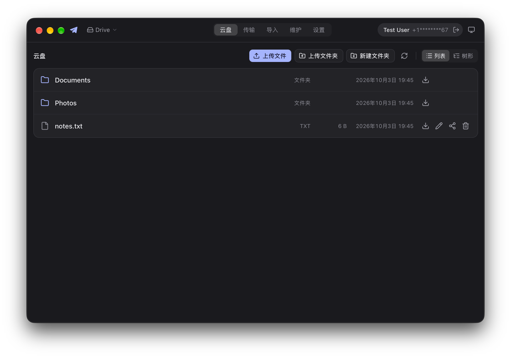

<p align="center">
  
</p>

<h1 align="center">tg-drive</h1>

<p align="center">
  <b>Turn a Telegram channel into a recoverable, scriptable file tree.</b><br />
  A CLI (<code>td</code>) and a desktop app (<code>td-gui</code>) for macOS, Windows, and Linux.
</p>

<p align="center">
  <a href="https://github.com/thedavidweng/tg-drive/actions/workflows/ci.yml"></a>
  <a href="https://github.com/thedavidweng/tg-drive/releases"></a>
  <a href="https://github.com/thedavidweng/tg-drive/blob/main/LICENSE"></a>
  
</p>

<p align="center">
  <a href="https://thedavidweng.github.io/tg-drive/"><b>Website</b></a>
  &nbsp;·&nbsp;
  <a href="https://github.com/thedavidweng/tg-drive/releases/latest"><b>Download</b></a>
  &nbsp;·&nbsp;
  <a href="docs/guides/getting-started.md"><b>Getting started</b></a>
  &nbsp;·&nbsp;
  <a href="docs/guides/cli-reference.md"><b>CLI reference</b></a>
</p>

<p align="center">
  
</p>

`td` uploads local files as ordinary Telegram media, stamps each message with
machine-readable metadata, and keeps a rebuildable SQLite index. You get
`ls`, `tree`, upload, download, move, and share. If the local database is
lost, `td scan --full` rebuilds it from the channel.

The channel stays a normal Telegram channel. Any native client can browse,
download, and filter folders by hashtag.

## Features

- **Plain Telegram underneath.** Files are ordinary media messages. Any Telegram client can browse them and filter folders by hashtag.
- **Recoverable.** Telegram is the source of truth. Lose the database and `td scan --full` rebuilds the index from the channel.
- **A real file tree.** Exact `ls` / `tree` over a local cache; upload and download whole trees; move, rename, delete, or tombstone files.
- **Scriptable.** Every command speaks stable `--json` on stdout, with documented exit codes.
- **Resumable uploads.** Files larger than 10 MB resume where they stopped; only unconfirmed parts are re-sent.
- **Bring what you have.** Adopt existing channel messages without re-uploading, and import Saved Messages with provenance and hash dedupe.
- **Desktop app.** `td-gui` puts the same engine behind a native window: drive, transfers, import, and maintenance.

## Install

macOS / Linux:

```sh
curl -fsSL https://raw.githubusercontent.com/thedavidweng/tg-drive/main/install.sh | sh
```

Windows (PowerShell):

```powershell
irm https://raw.githubusercontent.com/thedavidweng/tg-drive/main/install.ps1 | iex
```

The script installs into `~/.local/bin` (`%LOCALAPPDATA%\tg-drive\bin` on
Windows, added to the user `PATH`); `TD_INSTALL_DIR` overrides. If Homebrew
is present, the script uses the cask instead. Uninstall with
`install.sh uninstall`.

<details>
<summary><b>Homebrew, <code>go install</code>, or from source</b></summary>

```sh
# Homebrew
brew tap thedavidweng/tap
brew install --cask tg-drive

# go install (Go 1.26 or newer)
go install github.com/thedavidweng/tg-drive/cmd/td@latest

# From source
git clone https://github.com/thedavidweng/tg-drive.git
cd tg-drive
make build          # ./dist/td
```

</details>

### Desktop app (td-gui)

The same GitHub release also ships `td-gui`, the desktop app. CLI users pay
nothing for it: the `td` binary and packages stay exactly as they are.

| Platform | Artifacts |
| --- | --- |
| macOS (Apple Silicon + Intel) | `td-gui_<version>_darwin_universal.dmg` |
| Windows (x64) | `td-gui_<version>_windows_x86_64-installer.exe` |
| Linux | `td-gui_<version>_linux_x86_64.AppImage`, `td-gui_<version>_linux_amd64.deb` (arm64: `aarch64` / `arm64`) |

Each artifact has a `.sha256` sidecar. The Linux `.deb` depends on
`libgtk-4-1` and `libwebkitgtk-6.0-4` (Ubuntu 24.04+ / Debian 13+); install
with `sudo apt install ./td-gui_<version>_linux_amd64.deb`. The AppImage is
self-contained: `chmod +x` and run.

> [!NOTE]
> **The GUI artifacts are unsigned.** macOS and Windows warn on first
> launch; this is expected and safe to bypass.
>
> - **macOS (Gatekeeper):** after copying `td-gui.app` to Applications,
>   right-click it and choose **Open**, then confirm. Or remove the
>   quarantine flag: `xattr -d com.apple.quarantine /Applications/td-gui.app`.
> - **Windows (SmartScreen):** click **More info** → **Run anyway**. The
>   installer also installs the WebView2 runtime if your system lacks it.

## Requirements

`td` logs in as your Telegram user over MTProto. It is not a bot.

1. Open [my.telegram.org](https://my.telegram.org) → **API development tools**.
2. Create an application and copy `api_id` and `api_hash`.
3. Have your phone number ready (international format, e.g. `+1234567890`).
   You will confirm a login code and, if enabled, your 2FA password.

Treat `api_hash` and the session file as account credentials.

## Quick start

```sh
td auth setup                  # store api_id / api_hash
td auth login                  # phone code + optional 2FA
td init ~/Pictures --create-channel
td cp ~/Pictures/beach.jpg /2024/beach.jpg
td ls /
td tree /
td share /2024
```

`td init` binds one Telegram channel to a local root and runs an initial scan.
`td ls` and `td tree` read the local cache. `td share` prints an invite link
and the subtree hashtag.

To make Saved Messages content durable in the drive channel:

```sh
td import saved --dry-run --photos-as document
td import saved --photos-as document --confirm
```

The import mirrors Saved Messages sub-chats below `/saved`, preserves
forwarded-origin provenance, and records duplicate captions instead of
discarding them. Sources remain in Saved Messages unless
`--delete-source --confirm` is requested.

You only log in once. Later commands reuse the saved session.

## How it works

Each remote file is a Telegram media message with a human caption, plus its
machine record in the message's comment thread:

```text
media message caption:          discussion thread comment:
  display name                    td-manifest:v1
  parent path/                    p=<path> n=<name> s=<size>
                                  h=<hash> m=<mime> parent=<dir>
  #td_Pictures_<hash>             tags=#td_Pictures_<hash> ...
  #td_Pictures_<hash>_2024_<hash>
```

- **Telegram messages are the source of truth.** SQLite is a cache.
- Machine records live as comments in a linked discussion group so the
  channel timeline stays human-readable (ADR 0018). `td init` creates and
  links one; `td channels link-discussion` adds one to an existing channel.
- Machine recovery parses `td-manifest:v1` / `td-album:v1` comments first,
  then legacy `td:v1` captions and in-channel replies — never hashtags alone.
- Albums are one human post plus one `td-album:v1` inventory comment on the
  first member's thread.
- Directories are derived from file paths. They are not stored on Telegram.

After database loss, or on a new machine, bind the same channel again; init
rescans it and rebuilds the index:

```sh
td init ~/Pictures --bind-channel
```

## Usage

| Command | Purpose |
| --- | --- |
| `td auth` | Login, status, logout |
| `td init <root>` | Bind a local directory to one channel |
| `td cp` / `td get` | Upload / download |
| `td ls` / `td tree` | Browse the cache |
| `td mv` / `td rm` | Rename or delete |
| `td adopt` | Adopt existing Telegram messages |
| `td import saved` | Re-upload Saved Messages content |
| `td share` | Invite link and subtree hashtag |
| `td scan` / `td repair` | Rebuild or fix the index |
| `td doctor` / `td status` | Health and capability checks |
| `td config` | Read and write settings |

```sh
td cp --recursive ~/Pictures /Pictures
td cp --replace --confirm ~/new.jpg /2024/beach.jpg
td get --recursive /Pictures ./restore
td mv --confirm /2024/beach.jpg /Archive
td rm --confirm /2024/beach.jpg
td adopt --unmanaged --dry-run --channel "Pictures [TD]"
td import saved --dry-run --photos-as document
td scan --full
td doctor
```

Global flags: `--json`, `--quiet`, `--verbose`, `--config`, `--db`,
`--session`, `--channel`, `--wait`, `--no-wait`.

Destructive remote writes (`rm`, `mv`, `cp --replace`, `adopt`,
`import saved`, and `repair --delete-orphaned`) require `--confirm`.

See `td --help` and `td <command> --help` for the full flag list. Frozen
command and JSON shapes live in [`docs/contracts/`](docs/contracts/).

## Configuration

Precedence: CLI flags > `TD_*` environment variables > config file > defaults.

| Purpose | Default |
| --- | --- |
| Config | `~/.config/tg-drive/config.toml` |
| Session | `~/.config/tg-drive/session.json` |
| Cache DB | `~/.local/share/tg-drive/local_cache.db` |

A machine that already has these files under `tg-drive-cli` keeps using that
directory. Moving it is optional.

Overrides: `TD_CONFIG`, `TD_SESSION`, `TD_DB`, or `--config` / `--session` /
`--db`. Credentials can also come from `TD_API_ID` and `TD_API_HASH`.

`td auth login` reuses a pending login code instead of requesting a new one
(Telegram flood-waits accounts that request codes repeatedly). Use
`--resend` only when you need a fresh code.

## Hashtags

Each directory level gets a cumulative `#td_` tag so tapping a tag in Telegram
filters that folder. Chinese segments are transliterated to pinyin; other
scripts become ASCII plus a hash suffix.

Modern clients may show **global** hashtag results. Choose the **current
chat** tab. Public channels can use `#tag@username`; private channels cannot.

## Limits

- **One channel** per initialized root.
- **File-level** move and rename only. Directory move/delete are unsupported.
- **Empty directories** exist only in the local cache and disappear after a
  full scan.
- Incremental `td scan` does not see old messages edited or deleted directly
  in Telegram. Use `td scan --full`.
- Telegram **free** accounts: 2 GB per file. **Premium**: 4 GB.
- Caption edits on older messages can fail (`ERR_MESSAGE_NOT_EDITABLE`).
  `td doctor` reports whether edits currently work for your channel.
- Telegram rate-limits RPCs. `--wait` sleeps through safe flood waits;
  `--no-wait` fails immediately with `ERR_TELEGRAM_RATE_LIMITED`.
- Resumable uploads apply to files larger than 10 MB: a failed or interrupted
  upload can be retried as the same command, and only unconfirmed parts are
  re-sent (`--no-hash` is ignored on this path; content identity is verified
  before resuming). If a crash happens in the small window after Telegram
  accepted the media but before the index was written, the retry points you
  at `td repair --orphaned` instead of silently duplicating the message.

Later work is tracked in [GitHub Issues](https://github.com/thedavidweng/tg-drive/issues).

## Privacy

- Files live in Telegram cloud storage. Every channel member can view and
  download them.
- Captions and hashtags expose folder names. Do not put sensitive paths in a
  shared channel.
- Default delete mode removes the Telegram message. `tombstone` redacts the
  caption instead.
- Secrets (`api_hash`, phone, session, invite links, local paths, hashes) are
  redacted unless you pass `--show-secrets`.

See [SECURITY.md](SECURITY.md).

## Troubleshooting

```sh
td doctor              # config, session, auth, channel, permissions, limits
td status              # roots, last scan, pending and orphaned counts
td init <root> --bind-channel  # rebuild after DB loss or on a new machine
td scan --full         # refresh after old-message drift
td --verbose <cmd>     # diagnostics on stderr: paths, RPC timing, retries
td repair --pending    # stale pending uploads / expired locks
td repair --orphaned   # uploads that only partially landed on Telegram
```

- `ERR_MESSAGE_NOT_EDITABLE`: the message is too old to edit. Check `td doctor`.
- `td rm` removed the file but could not update its machine record
  (`ERR_TELEGRAM_RPC` with `details.stale_manifest`): the file is already
  gone; pass `--allow-stale-manifest` to accept stale records.
- Rate limited: retry with `--wait`, or raise `rate_limit.max_wait_seconds`.

## Documentation

Guides ([Diátaxis](https://diataxis.fr) taxonomy — all under
[`docs/guides/`](docs/guides/)):

Learning

- [Getting started](docs/guides/getting-started.md) — first login, upload,
  browse, download, share

Task-oriented how-tos

- [Recover the index](docs/guides/recover-the-index.md) — rebuild after
  database loss, repair pending/orphaned uploads
- [Adopt an existing channel](docs/guides/adopt-an-existing-channel.md) —
  claim messages without re-uploading
- [Organize files](docs/guides/organize-files.md) — move, rename, delete,
  tombstone safely
- [Share folders](docs/guides/share-and-navigate.md) — invite links and
  hashtag navigation
- [Script with JSON](docs/guides/script-with-json.md) — envelopes, events,
  exit codes
- [Troubleshoot](docs/guides/troubleshoot.md) — doctor, rate limits, common
  errors

Understanding & reference

- [How td works](docs/guides/how-td-works.md) — the model behind the CLI
- [CLI reference](docs/guides/cli-reference.md) — every command and flag

Developer documentation

- [Architecture](docs/architecture.md)
- [CLI contract](docs/contracts/cli-contract.md)
- [JSON contract](docs/contracts/json-contract.md)
- [Storage contract](docs/contracts/storage-contract.md)
- [Config contract](docs/contracts/config-contract.md)
- [Decisions](DECISIONS.md)
- [Testing](docs/testing.md)
- [Release and CI](docs/release-and-ci.md)
- [Contributing](CONTRIBUTING.md)
- [Security](SECURITY.md)
- [Changelog](CHANGELOG.md)

## License

[Apache-2.0](LICENSE)
